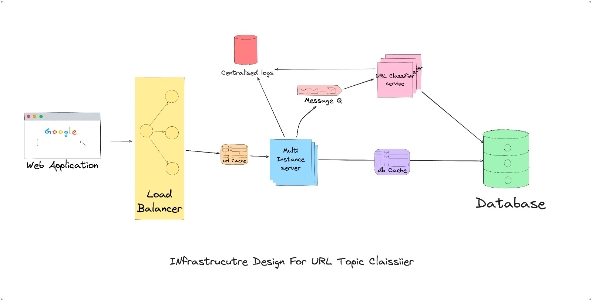

# Design Documentation: Operationalizing URL Collection and Optimization

## Overview

The objective is to operationalize the collection of millions of URLs using the URL Topic Classifier code and optimize the system for reliability, performance, and scalability. This documentation outlines the key steps and considerations for achieving this goal.

## Current System Overview
- **URL Topic Classifier**: The existing Python script (main.py) can analyze a list of web URLs, extract text content, identify topics, and store the results in a CSV file. It uses libraries such as requests, BeautifulSoup, stanza, nltk, and csv.

## Steps for Operationalization
1. **Infrastructure Scaling**
- *Scaling Up Resources*: Depending on the expected volume of URLs to process, consider scaling up the infrastructure. Use cloud-based solutions or high-performance servers to handle the load effectively e.g. AWS

- *Load Balancing*: Implement load balancing to distribute incoming requests evenly across multiple instances of the script to ensure optimal resource utilization.

2. **Data Storage**
- *Database*: Instead of storing data in CSV files, consider using a database (e.g., PostgreSQL, MySQL) to store URL data, extracted text, and identified topics. This allows for efficient data retrieval, indexing, and querying.

- *NoSQL Databases*: If dealing with unstructured data, a NoSQL database (e.g., MongoDB) might be more suitable.

3. **Distributed Processing**
- *Parallel Processing*: Implement parallel processing techniques to analyze multiple URLs concurrently. Libraries like multiprocessing, multithreadprocessing in Python can be used for this purpose.

- *Queue System*: Use a queue system (e.g., RabbitMQ, Apache Kafka) to distribute URLs to multiple worker instances, allowing for efficient and distributed processing.

4. **Monitoring and Logging**
- *Monitoring Tools*: Implement monitoring tools to track system performance, resource utilization, and errors in real-time. Tools like Grafana or Relic can be valuable.

- *Logging*: Use structured logging to record relevant information about URL processing, errors, and warnings. Centralize logs using solutions like Elasticsearch.

5. **Error Handling and Retry Mechanisms**
- *Error Handling*: Enhance error handling to gracefully handle exceptions, retries, and timeouts during URL processing. Implement a comprehensive error-handling strategy.

- *Retry Mechanisms*: Implement retry mechanisms for failed URL processing to ensure data completeness.

6. **Rate Limiting and Throttling to Avoid Getting Blocked**
- *Rate Limiting*: Implement rate limiting and throttling mechanisms to prevent overloading external websites while collecting data. Adhere to ethical web scraping practices.

7. **Data Privacy and Compliance**
- *Data Privacy*: Ensure compliance with data privacy regulations (e.g., GDPR) when collecting and storing user data.

8. **API Integration**
- *API Integration*: If applicable, integrate with external APIs for data enrichment and verification of collected information.

## Next Steps
To further optimize for reliability, performance, and scale:

- **Caching**: Implement caching mechanisms to store and retrieve previously processed URLs and results, reducing redundant processing.

- **Tackle Anti-Scrapping mechanisms**: Figure out a way to scrape website with anti-scraping mechanism like captcha, implement rate-limiting, retry mechanisms.

- **Auto-Scaling**: Configure auto-scaling policies to dynamically adjust the number of processing instances based on workload.

- **Use Queues**: Utilize task queues e.g(RabbitMQ & Kafka) for long-running tasks, ensuring that URL processing continues without interruption.

- **Advanced NLP**: Explore advanced NLP techniques for topic identification, sentiment analysis, and entity recognition.

- **Security**: Ensure data security through encryption, access controls, and vulnerability assessments.

- **Documentation and Training**: Maintain comprehensive documentation and provide training to the operations team for efficient system management.

- **Cost Optimization**: Regularly review and optimize infrastructure costs by selecting appropriate instance types and scaling based on actual usage.